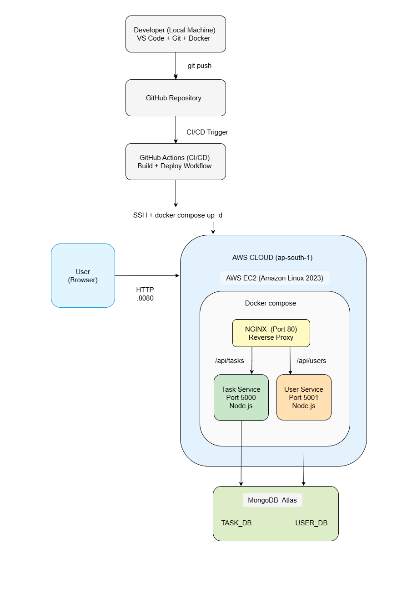

# CI/CD Deployed Docker Microservices on AWS EC2

JWT-secured Docker microservices deployed on AWS EC2 using GitHub Actions CI/CD, with Nginx reverse proxy and MongoDB Atlas.

## 🏗️ System Architecture

## ✅ Deployment Proofs

Refer to: docs/proofs/